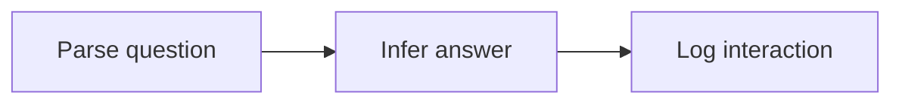

# mlops

## Objective
Given an SUTD room name or address, return the corresponding SUTD room address or name at low latency using a language model.

## Data
[Getting around SUTD](https://sutd.edu.sg/contact-us/getting-around-sutd).
1. Scrape.
2. Standardise.
3. Augment.

### Pre-training
Contains rows of SUTD room names concatenated with rows of SUTD room addresses.

### Fine-tuning
Contains rows of `X<Y>`, where `X` is a SUTD room name or address, and `<` is a beginning-of-sequence (BOS) token, and `Y` is a SUTD room address or name, and `>` is an end-of-sequence (EOS) token.

## Architecture
Transformer.

## Loss
Cross-entropy.
